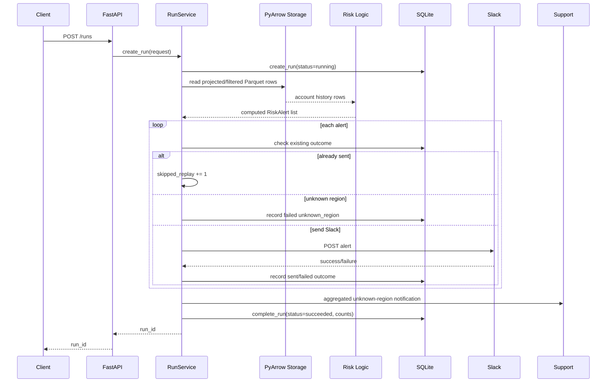

# FDE Take-Home: Risk Alert Service

FastAPI batch service for generating and delivering At Risk account alerts from monthly account-status Parquet data.

The service reads account history from `file://` or `gs://`, deduplicates account/month records, computes continuous At Risk duration, routes alerts to Slack by region, and persists run/outcome state in SQLite for replay safety.

## Features

* `GET /health` health check
* `POST /preview` computes alerts without sending Slack
* `POST /runs` runs the alert batch and sends Slack notifications
* `GET /runs/{run_id}` returns persisted run results
* Reads local Parquet files and GCS Parquet files
* Uses PyArrow column projection and filtered scans
* Deduplicates `(account_id, month)` using latest `updated_at`
* Computes continuous At Risk duration month by month
* Routes alerts by region
* Retries Slack 429 and 5xx responses
* Records failed deliveries without aborting the entire run
* Enforces replay safety with SQLite uniqueness on `(account_id, month, alert_type)`

## Project structure

```text
app/
  main.py          FastAPI routes and startup lifecycle
  config.py        Environment-driven configuration
  models.py        API/domain Pydantic models
  storage.py       file://, gs://, and s3:// storage abstraction
  risk_logic.py    Deduplication, filtering, and duration calculation
  db.py            SQLite persistence and replay safety
  slack.py         Slack payload formatting and delivery
  support.py       Support notification stub for unknown-region accounts
  run_service.py   Batch orchestration layer

tests/
```

## Requirements

Python 3.11 is recommended.

Install dependencies:

```bash
python -m venv .venv
source .venv/bin/activate

pip install -r requirements.txt
```

## Configuration

The service is configured through environment variables.

| Variable                 |                       Default | Description                                                 |
| ------------------------ | ----------------------------: | ----------------------------------------------------------- |
| `ARR_THRESHOLD`          |                       `25000` | Minimum ARR for alerting when ARR is present                |
| `SQLITE_DB_PATH`         |              `risk_alerts.db` | SQLite database path                                        |
| `DETAILS_BASE_URL`       | `https://app.yourcompany.com` | Base URL used to build account details links                |
| `SLACK_WEBHOOK_BASE_URL` |                         unset | Local/mock Slack base URL. Posts to `{base}/{channel}`      |
| `SLACK_WEBHOOK_URL`      |                         unset | Slack incoming webhook URL                                  |
| `SUPPORT_EMAIL`          |          `support@quadsci.ai` | Intended recipient for unknown-region support notifications |

Slack URL precedence:

```text
SLACK_WEBHOOK_BASE_URL wins over SLACK_WEBHOOK_URL
```

For local mock Slack:

```bash
export SLACK_WEBHOOK_BASE_URL=http://localhost:9000/slack/webhook
```

This sends alerts to URLs like:

```text
http://localhost:9000/slack/webhook/amer-risk-alerts
http://localhost:9000/slack/webhook/emea-risk-alerts
http://localhost:9000/slack/webhook/apac-risk-alerts
```

## ARR threshold behavior

`ARR_THRESHOLD` defaults to `25000`.

The threshold is only applied when ARR is present:

```text
ARR = 50000  -> included if threshold is 25000
ARR = 10000  -> filtered out
ARR = null   -> included
```

A missing ARR is treated as unknown, not as low ARR. This avoids silently dropping accounts with incomplete data.

## Region routing

Alerts are routed by `account_region`:

| Region | Slack channel      |
| ------ | ------------------ |
| `AMER` | `amer-risk-alerts` |
| `EMEA` | `emea-risk-alerts` |
| `APAC` | `apac-risk-alerts` |

If `account_region` is missing or unknown:

* no Slack message is sent
* the alert outcome is recorded as `failed`
* the error is recorded as `unknown_region`
* the account is included in a single aggregated support notification

For this app, `support.py` logs the support notification instead of sending real email. In prod, this could be backed by SES, SMTP, or a customer notification service.

## Running locally

Start the API:

```bash
uvicorn app.main:app --reload --port 8000
```

Health check:

```bash
curl http://localhost:8000/health
```

Expected response:

```json
{
  "ok": true
}
```

## Preview alerts

`POST /preview` computes alerts but does not send Slack and does not write delivery outcomes.

```bash
curl -X POST http://localhost:8000/preview \
  -H "Content-Type: application/json" \
  -d '{
    "source_uri": "file:///absolute/path/to/monthly_account_status.parquet",
    "month": "2026-01-01",
    "dry_run": true
  }'
```

Example response:

```json
{
  "month": "2026-01-01",
  "duplicate_rows": 308,
  "alerts": [
    {
      "account_id": "a00702",
      "account_name": "Account 0702",
      "account_region": "EMEA",
      "channel": "emea-risk-alerts",
      "month": "2026-01-01",
      "duration_months": 8,
      "risk_start_month": "2025-06-01",
      "arr": 53557,
      "renewal_date": "2026-02-01",
      "account_owner": null,
      "details_url": "https://app.yourcompany.com/accounts/a00702"
    }
  ]
}
```

## Run the batch

`POST /runs` computes alerts, sends Slack messages, persists outcomes, and returns a `run_id`.

```bash
curl -X POST http://localhost:8000/runs \
  -H "Content-Type: application/json" \
  -d '{
    "source_uri": "file:///absolute/path/to/monthly_account_status.parquet",
    "month": "2026-01-01",
    "dry_run": false
  }'
```

Example response:

```json
{
  "run_id": "3df0a8d6-5c1f-4e2e-bf25-8d6c7f0e3f41"
}
```

Dry-run behavior for `/runs`:

```text
dry_run=true
  - computes alerts
  - creates/completes a run row
  - does not send Slack
  - does not write sent alert outcomes
  - does not affect replay safety
```

## Get run result

```bash
curl http://localhost:8000/runs/{run_id}
```

Example response:

```json
{
  "run_id": "3df0a8d6-5c1f-4e2e-bf25-8d6c7f0e3f41",
  "status": "succeeded",
  "counts": {
    "rows_scanned": 8308,
    "alerts_sent": 92,
    "skipped_replay": 0,
    "failed_deliveries": 3,
    "duplicate_rows": 308
  },
  "sample_alerts": [
    {
      "account_id": "a00702",
      "account_name": "Account 0702",
      "account_region": "EMEA",
      "channel": "emea-risk-alerts",
      "month": "2026-01-01",
      "duration_months": 8,
      "risk_start_month": "2025-06-01",
      "arr": 53557,
      "renewal_date": "2026-02-01",
      "account_owner": null,
      "details_url": "https://app.yourcompany.com/accounts/a00702"
    }
  ],
  "sample_errors": [
    {
      "account_id": "a00090",
      "account_name": "Account 0090",
      "account_region": null,
      "month": "2026-01-01",
      "channel": null,
      "alert_type": "at_risk",
      "status": "failed",
      "sent_at": null,
      "error": "unknown_region"
    }
  ]
}
```

## Replay safety

SQLite stores alert outcomes in `alert_outcomes`.

The table enforces uniqueness on:

```text
(account_id, month, alert_type)
```

Current alert type:

```text
at_risk
```

Replay behavior:

```text
Previously sent outcome:
  - Slack is not sent again
  - run count skipped_replay is incremented
  - original sent row is preserved

Previously failed outcome:
  - retry is allowed
  - row can be overwritten by a later sent or failed outcome

No previous outcome:
  - insert new outcome
```

This prevents duplicate Slack alerts while still allowing retry of failed deliveries.

## Slack alert format

Each Slack alert includes:

```text
🚩 At Risk: {account_name} ({account_id})
Region: {account_region}
At Risk for: X months (since YYYY-MM-01)
ARR: {arr or Unknown}
Renewal date: {renewal_date or Unknown}
Owner: {account_owner, if present}
Details URL: {DETAILS_BASE_URL}/accounts/{account_id}
```

Example:

```text
🚩 At Risk: Account 0702 (a00702)
Region: EMEA
At Risk for: 8 months (since 2025-06-01)
ARR: $53,557
Renewal date: 2026-02-01
Details URL: https://app.yourcompany.com/accounts/a00702
```

## Storage support

Supported:

```text
file://...
gs://bucket/path/file.parquet
```

Recognized extension point:

```text
s3://bucket/path/file.parquet
```

S3 is intentionally recognized by the storage abstraction but not implemented for this exercise.

### GCS authentication

GCS access uses ambient Google credentials through PyArrow/GCS support.

For local development:

```bash
gcloud auth application-default login
```

Or set:

```bash
export GOOGLE_APPLICATION_CREDENTIALS=/path/to/service-account.json
```

No credentials should be placed in `source_uri`.

## Scale awareness

The Parquet file may be large, so the service avoids loading unnecessary data.

The storage/risk logic uses:

* PyArrow Dataset API
* column projection
* filtered scans
* narrow column lists
* deduplication after scanning only needed rows

The risk logic scans only rows with:

```text
month <= target_month
```

and only the columns needed for alert computation:

```text
account_id
account_name
account_region
month
status
renewal_date
account_owner
arr
updated_at
```

The service materializes the filtered Arrow table into Python rows only after projection/filtering.

## Architecture



## Tests

Run all tests:

```bash
pytest
```

Run specific tests:

```bash
pytest tests/test_risk_logic.py -v
pytest tests/test_slack.py -v
pytest tests/test_db.py -v
pytest tests/test_run_service.py -v
```

## Docker

Build:

```bash
docker build -t risk-alert-service .
```

Run:

```bash
docker run --rm -p 8000:8000 \
  -e ARR_THRESHOLD=25000 \
  -e SQLITE_DB_PATH=/tmp/risk_alerts.db \
  -e SLACK_WEBHOOK_BASE_URL=http://host.docker.internal:9000/slack/webhook \
  risk-alert-service
```

Then call:

```bash
curl http://localhost:8000/health
```

## Design notes

### Why `running -> succeeded/failed` run lifecycle?

A run row is inserted before alert processing starts. This lets alert outcomes reference the run via foreign key and leaves a persisted failed run if a fatal error occurs.

Per-alert Slack failures do not fail the whole run. They are recorded as failed deliveries.

Fatal processing errors, such as unreadable Parquet or invalid schema, mark the run as failed and surface an API error.

### Why not record dry-run outcomes?

Dry runs should not affect replay safety. A dry run computes alerts but does not insert sent outcomes because that could make a later real run incorrectly skip slack delivery.
