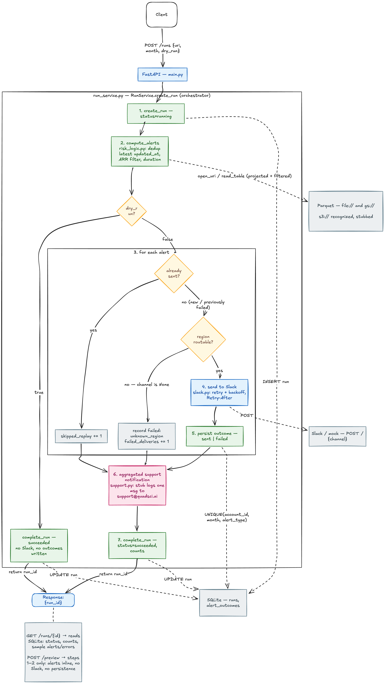
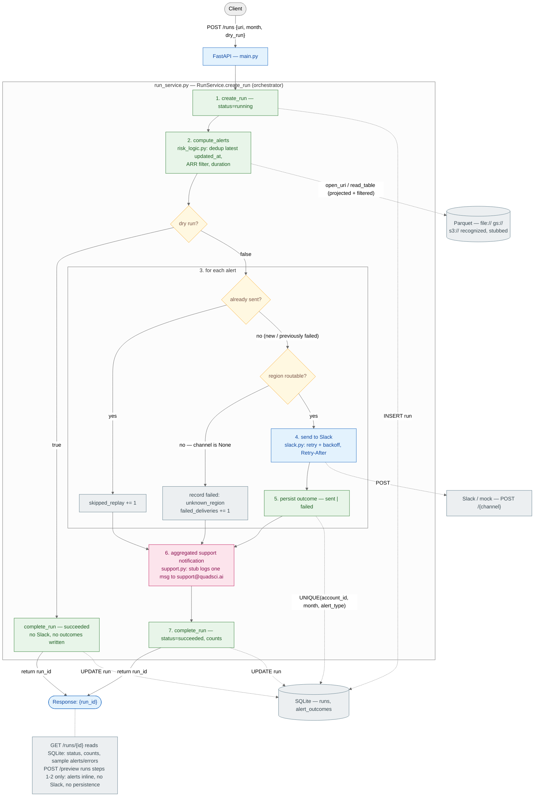

# Monthly Account Risk Alerts

A FastAPI service that reads monthly account-status Parquet data, finds accounts
that are currently **At Risk**, computes how long each has been continuously at
risk, and posts region-routed alerts to Slack. Runs are persisted in SQLite so
re-running the same month is idempotent (no duplicate alerts).

## Endpoints

| Method | Path | Purpose |
| --- | --- | --- |
| `GET` | `/health` | Health check |
| `POST` | `/preview` | Compute alerts for a month;no Slack, no persistence |
| `POST` | `/runs` | Execute a run synchronously, send Slack, persist outcomes, return a `run_id` |
| `GET` | `/runs/{run_id}` | Persisted run status, counts, and sample alerts/errors |

## Project structure

```text
app/
  main.py          FastAPI routes and startup/shutdown
  config.py        Env configuration
  models.py        API/domain models
  storage.py       Parquet access (file:// and gs://)
  risk_logic.py    Dedup, ARR filtering, continuous-at-risk duration
  db.py            SQLite persistence + replay safety
  slack.py         Slack payload formatting + delivery with retries and backoffs
  support.py       Aggregated notification stub
  run_service.py   Run orchestrator
tests/             Unit tests for each module
```

## Setup

Python 3.11 recommended.

```bash
python -m venv .venv
source .venv/bin/activate
pip install -r requirements.txt
```

## Configuration

All configuration is via environment variables.

| Variable | Default | Description |
| --- | --- | --- |
| `ARR_THRESHOLD` | `25000` | Minimum ARR to alert on, when ARR is present (see note below) |
| `SQLITE_DB_PATH` | `risk_alerts.db` | SQLite file path |
| `DETAILS_BASE_URL` | `https://app.yourcompany.com` | Base URL for account detail links in alerts |
| `SLACK_WEBHOOK_BASE_URL` | unset | Base URL for per-channel posting; posts to `{base}/{channel}` |
| `SLACK_WEBHOOK_URL` | unset | Single Slack incoming webhook (used only if the base URL is unset) |

`SLACK_WEBHOOK_BASE_URL` takes precedence over `SLACK_WEBHOOK_URL`. For the local
mock Slack server, set the base URL so alerts route per channel:

```bash
export SLACK_WEBHOOK_BASE_URL=http://localhost:9000/slack/webhook
```

Alerts then post to `…/amer-risk-alerts`, `…/emea-risk-alerts`, `…/apac-risk-alerts`.

The support-notification recipient (`support@quadsci.ai`) is defined in
`app/support.py`; it is not currently an environment variable.

### ARR threshold behavior

The threshold is applied **only when ARR is present**. A missing ARR (`null`) is
treated as unknown, so accounts with incomplete data are not
silently dropped:

- `arr = 50000` → included (≥ 25000)
- `arr = 10000` → filtered out (< 25000)
- `arr = null` → included

The default of `25000` was chosen against the provided dataset: the maximum ARR
in the data is just under `100000`. `25000` surfaces a meaningful set of
at-risk accounts while still filtering the lowest-value ones.

### Region routing

| `account_region` | Slack channel |
| --- | --- |
| `AMER` | `amer-risk-alerts` |
| `EMEA` | `emea-risk-alerts` |
| `APAC` | `apac-risk-alerts` |

If `account_region` is missing or unknown, the account is **not** sent to Slack.
Instead the outcome is recorded as `failed` with error `unknown_region`, and the
account is included in a single aggregated support notification at the end of the
run. For this application `support.py` logs that notification; in production the same
function would send using SES, SMTP, or an internal notification service.

## Running locally

Start the mock Slack server (see `mock_slack/`), then:

```bash
export SLACK_WEBHOOK_BASE_URL=http://localhost:9000/slack/webhook
uvicorn app.main:app --reload --port 8000
```

### Health

```bash
curl http://localhost:8000/health
# {"ok": true}
```

### Preview (no Slack, no persistence)

```bash
PARQUET="file://$(pwd)/monthly_account_status.parquet"

curl -X POST http://localhost:8000/preview \
  -H "Content-Type: application/json" \
  -d "{\"source_uri\": \"$PARQUET\", \"month\": \"2026-01-01\", \"dry_run\": true}"
```

Example response (truncated to one alert):

```json
{
  "month": "2026-01-01",
  "duplicate_rows": 308,
  "alerts": [
    {
      "account_id": "a00702",
      "account_name": "Account 0702",
      "account_region": "EMEA",
      "channel": "emea-risk-alerts",
      "month": "2026-01-01",
      "duration_months": 8,
      "risk_start_month": "2025-06-01",
      "arr": 53557,
      "renewal_date": "2026-02-01",
      "account_owner": null,
      "details_url": "https://app.yourcompany.com/accounts/a00702"
    }
  ]
}
```

### Run the batch

```bash
PARQUET="file://$(pwd)/monthly_account_status.parquet"

curl -X POST http://localhost:8000/runs \
  -H "Content-Type: application/json" \
  -d "{\"source_uri\": \"$PARQUET\", \"month\": \"2026-01-01\", \"dry_run\": false}"
# {"run_id": "3df0a8d6-5c1f-4e2e-bf25-8d6c7f0e3f41"}
```

A dry run (`"dry_run": true`) computes alerts and records a run row, but sends no
Slack and writes no `sent` outcomes — so it never affects replay safety.

### Get a run result

```bash
curl http://localhost:8000/runs/3df0a8d6-5c1f-4e2e-bf25-8d6c7f0e3f41
```

Example response (samples truncated):

```json
{
  "run_id": "3df0a8d6-5c1f-4e2e-bf25-8d6c7f0e3f41",
  "status": "succeeded",
  "month": "2026-01-01",
  "counts": {
    "rows_scanned": 10587,
    "duplicate_rows": 308,
    "alerts_sent": 107,
    "skipped_replay": 0,
    "failed_deliveries": 3
  },
  "sample_alerts": [
    {
      "account_id": "a00702",
      "account_name": "Account 0702",
      "account_region": "EMEA",
      "channel": "emea-risk-alerts",
      "month": "2026-01-01",
      "duration_months": 8,
      "risk_start_month": "2025-06-01",
      "arr": 53557,
      "renewal_date": "2026-02-01",
      "account_owner": null,
      "details_url": "https://app.yourcompany.com/accounts/a00702"
    }
  ],
  "sample_errors": [
    {
      "account_id": "a00090",
      "account_name": "Account 0090",
      "account_region": null,
      "month": "2026-01-01",
      "channel": null,
      "alert_type": "at_risk",
      "status": "failed",
      "sent_at": null,
      "error": "unknown_region"
    }
  ]
}
```

The `110` total alerts for `2026-01-01` split into `107` routable (sent) and `3`
unknown-region (recorded `failed`, reported to support). Re-running the same month
returns `skipped_replay: 107` and sends nothing.

## Replay safety

`alert_outcomes` enforces uniqueness on `(account_id, month, alert_type)`. On a re-run:

- **Already sent** -> Slack is not called again, `skipped_replay` is incremented, and
  the original `sent` row is preserved.
- **Previously failed** -> the alert is retried, and the row can be overwritten by a
  later `sent` or `failed` outcome.
- **No prior outcome** → a new outcome is inserted.

The run lifecycle is two-phase: a `running` row is inserted first, then the run is marked `succeeded` or `failed` with
final counts. A per-alert Slack failure is recorded as a failed delivery and does
**not** fail the run; only an unprocessable run like a unreadable Parquet is marked
`failed` and surfaced as an API error.

## Slack alert format

```text
🚩 At Risk: Account 0702 (a00702)
Region: EMEA
At Risk for: 8 months (since 2025-06-01)
ARR: $53,557
Renewal date: 2026-02-01
Owner: <only shown when present>
Details URL: https://app.yourcompany.com/accounts/a00702
```

Delivery retries on HTTP `429` and `5xx` with exponential backoff, honoring the
`Retry-After` header when present. Non-retryable `4xx` responses fail immediately.

## Storage and scale

Parquet is read through the PyArrow Dataset API with column projection and a row
filter pushed down to the scan — only `month <= target_month` and only the columns
needed for alert computation are materialized, so the full file is never loaded
into memory unnecessarily. Local (`file://`) and GCS (`gs://`) sources are
supported.

GCS uses ambient Google credentials (Application Default Credentials):

```bash
gcloud auth application-default login
# or
export GOOGLE_APPLICATION_CREDENTIALS=/path/to/service-account.json
```

Credentials are never placed in `source_uri`.

## Architecture





 

## Tests

```bash
pytest
```

Covers configuration, persistence/replay (sent preserved, failed retried),
risk logic (duration, dedup, ARR threshold, unknown region), run orchestration
(dry run, unknown region + support, send, failure-but-run-succeeds, replay skip),
and Slack payload/URL formatting.

## Docker

```bash
docker build -t risk-alert-service .

docker run --rm -p 8000:8000 \
  -e ARR_THRESHOLD=25000 \
  -e SQLITE_DB_PATH=/tmp/risk_alerts.db \
  -e SLACK_WEBHOOK_BASE_URL=http://host.docker.internal:9000/slack/webhook \
  risk-alert-service

curl http://localhost:8000/health
```